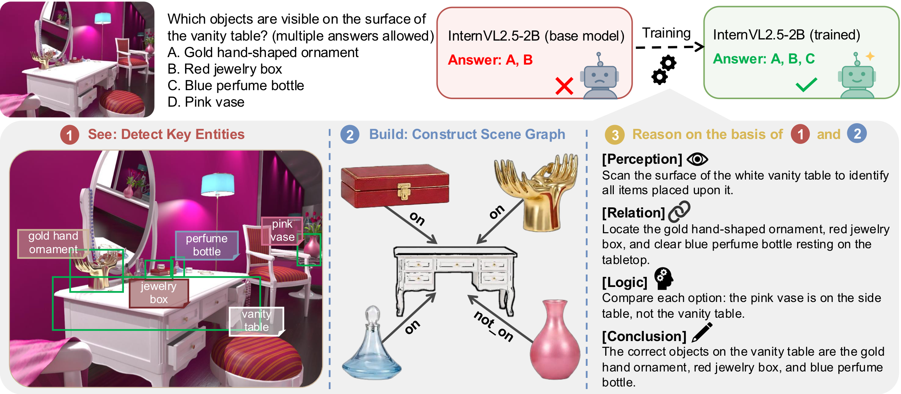
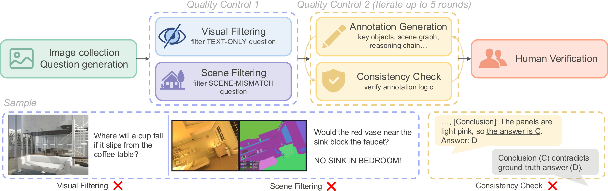
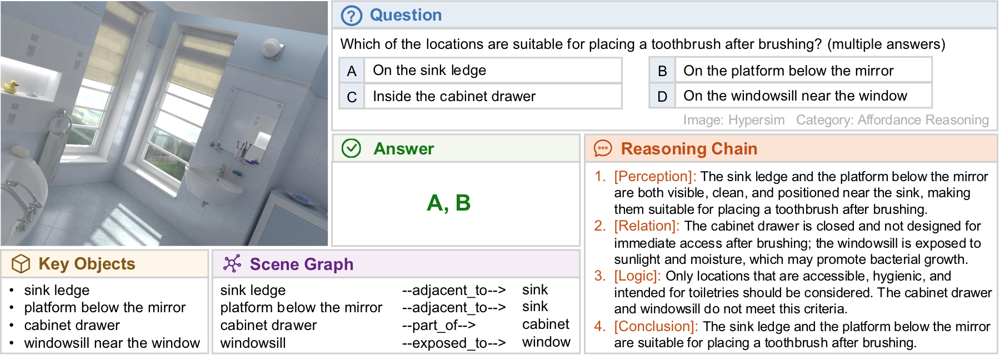
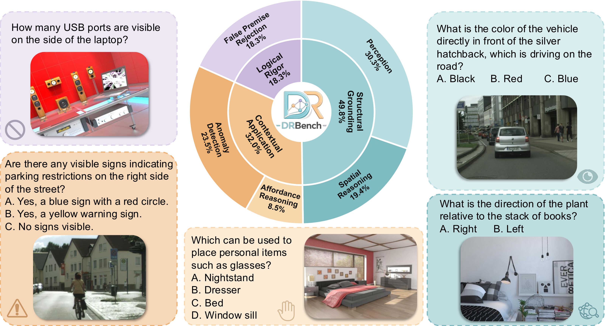
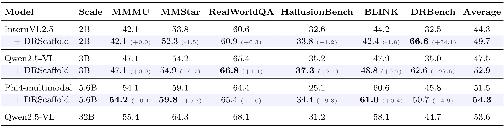
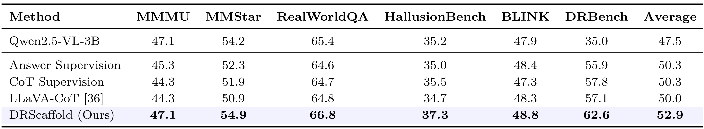
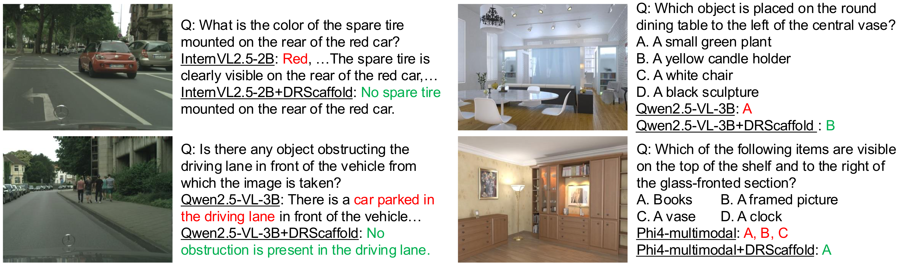
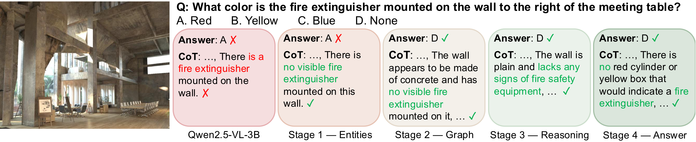

# DRScaffold: Boosting Dense-Scene Reasoning in Lightweight Vision Language Models

[Xinrui Shi](https://github.com/irene-shi), [Kai Liu](https://kai-liu.cn/), Ziqing Zhang, Jianze Li, Anqi Li, and [Yulun Zhang](http://yulunzhang.com/)

"DRScaffold: Boosting Dense-Scene Reasoning in Lightweight Vision Language Models", arxiv, 2026

<div>
<a href="https://github.com/irene-shi/DRScaffold" target='_blank' style="text-decoration: none;"></a>
<a href="https://github.com/irene-shi/DRScaffold/stargazers" target='_blank' style="text-decoration: none;"></a>
</div>

[[arXiv](https://arxiv.org/abs/xxxx.xxxxx)]

#### 🔥🔥🔥 News

- **2026-05-06:** This repo is released. ⭐️⭐️⭐️

---


> **Abstract:** Lightweight vision-language models perform competitively on standard benchmarks yet fail systematically in dense-scene reasoning, where multiple objects, attributes, and relations must be jointly grounded and resolved through multi-step inference. Such capability is critical for real-world applications where models must reliably interpret cluttered environments. Yet existing training signals provide no explicit grounding between reasoning steps and the underlying visual entities and relations, leaving lightweight models free to generate fluent but visually unanchored reasoning chains. To address this gap, we first introduce DRBench, a benchmark of 14,573 questions across 2,943 images, organized into five task categories spanning three progressive reasoning layers. Building on DRBench, we propose DRScaffold, a supervised fine-tuning framework that decomposes the supervision target into four causally ordered stages, enforcing grounded reasoning without architectural modification. Experiments on three lightweight VLMs demonstrate substantial gains on DRBench while preserving or improving performance on general-purpose benchmarks. Notably, Qwen2.5-VL-3B trained with DRScaffold surpasses the frozen Qwen2.5-VL-32B on DRBench, demonstrating that structured supervision can substitute for a significant portion of model scale in dense-scene reasoning.


## ⚒️ TODO
- [x] Release paper.
- [ ] Release project page.
- [ ] Release DRBench dataset.
- [ ] Release training code.
- [ ] Release LoRA adapters.
- [ ] Provide HuggingFace demo.

## <a name="contents"></a>🔗 Contents
- [DRBench](#drbench)
- [DRScaffold](#drscaffold)
- [Results](#results)
- [Citation](#citation)
- [Acknowledgements](#acknowledgements)

## <a name="drbench"></a>📊 DRBench 

- data construction pipeline
  <p align="center">
    
  </p>

- data annotation sample
  <p align="center">
    
  </p>

- data distribution
  <p align="center">
    
  </p>

## <a name="drscaffold"></a>💡 DRScaffold 

DRScaffold decomposes supervision into four causally ordered stages: **Entity Grounding**, **Relation Modeling**, **Stepwise Reasoning**, and **Answer Generation**. The framework uses staged gradient masking to enforce grounded reasoning without modifying model architecture.

<p align="center">
  
</p>

## <a name="results"></a> 🔎 Results

DRScaffold consistently improves dense-scene reasoning quality over base lightweight VLMs while preserving performance on general-purpose benchmarks.

<details>
<summary>Click to expand</summary>

- quantitative comparisons
  <p align="center">
  
  </p>

  <p align="center">
  
  </p>

- qualitative comparisons

  <p align="center">
  
  </p>

  <p align="center">
  
  </p>

</details>

## <a name="citation"></a>📎 Citation
If you find the code helpful in your research or work, please cite the following paper(s).

```
@article{shi2026drscaffold,
  title={DRScaffold: Boosting Dense-Scene Reasoning in Lightweight Vision Language Models},
  author={Shi, Xinrui and Liu, Kai and Zhang, Ziqing and Li, Jianze and Li, Anqi and Zhang, Yulun},
  journal={arXiv preprint arXiv:2605.26038},
  year={2026}
}
```

## <a name="acknowledgements"></a> 💖 Acknowledgements

This project is based on [ms-swift](https://github.com/modelscope/ms-swift). Thanks for their great work.
